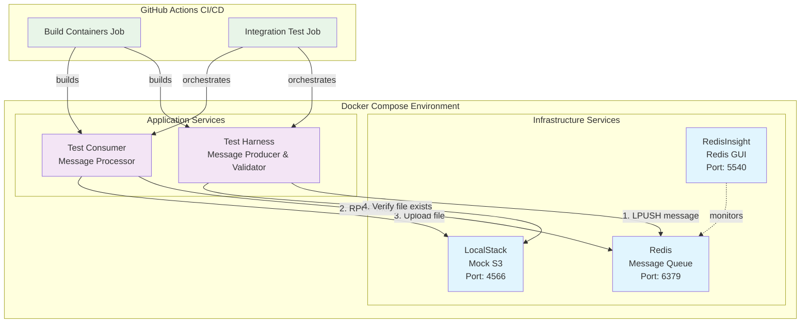
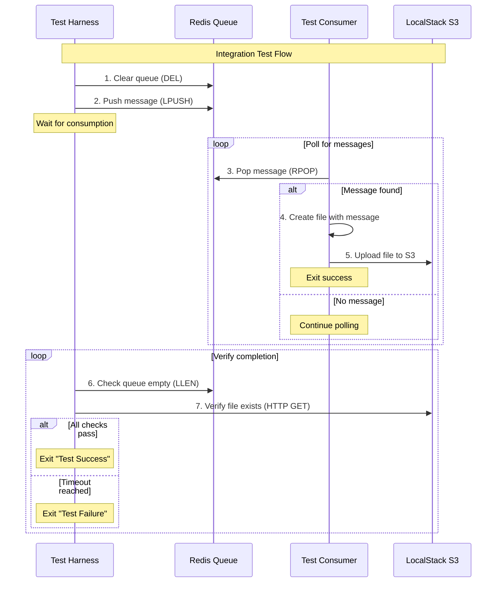
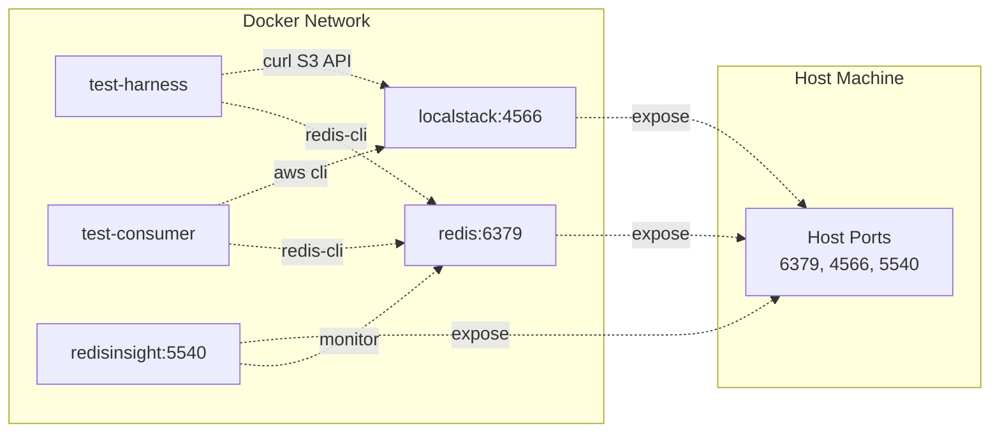
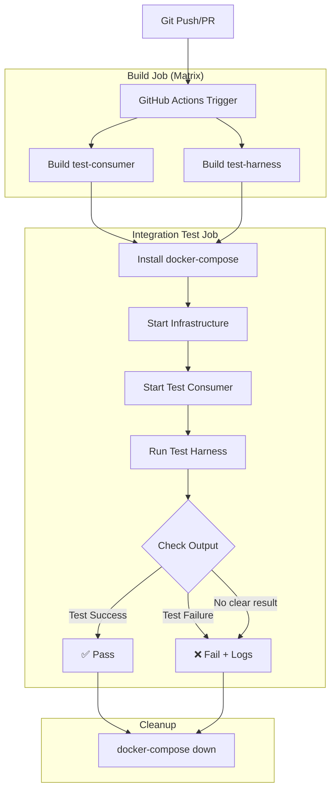

# Architecture Diagram

## System Overview



## Component Details

### Infrastructure Services

| Component | Purpose | Port | Technology |
|-----------|---------|------|------------|
| **Redis** | Message queue storage | 6379 | Redis 7 |
| **LocalStack** | Mock AWS S3 service | 4566 | LocalStack |
| **RedisInsight** | Redis monitoring GUI | 5540 | RedisInsight |

### Application Services

| Component | Purpose | Dependencies | Technology |
|-----------|---------|--------------|------------|
| **Test Harness** | Generates messages, validates results | Redis, LocalStack | Alpine + Bash |
| **Test Consumer** | Processes messages, uploads files | Redis, LocalStack | Alpine + Bash |

## Message Flow



## Network Architecture



## CI/CD Pipeline Architecture



## File Structure

```
redis_test/
├── docker-compose.yml          # Service orchestration
├── .github/workflows/          # CI/CD pipeline
│   └── build-containers.yml
├── systemUnderTest/            # Test consumer
│   ├── Dockerfile             # Alpine-based image
│   └── test-consumer.sh       # Message processor
├── testHarness/               # Test harness
│   ├── Dockerfile             # Alpine-based image
│   └── test-harness.sh        # Test orchestrator
└── architecture.md           # This documentation
```

## Environment Variables

| Variable | Purpose | Default | Used By |
|----------|---------|---------|---------|
| `REDIS_HOST` | Redis hostname | `redis` | Both |
| `REDIS_PORT` | Redis port | `6379` | Both |
| `S3_BUCKET` | S3 bucket name | `test-bucket` | Both |
| `S3_ENDPOINT_URL` | LocalStack S3 URL | `http://localstack:4566` | Both |
| `AWS_ACCESS_KEY_ID` | Mock AWS key | `test` | Both |
| `AWS_SECRET_ACCESS_KEY` | Mock AWS secret | `test` | Both |
| `AWS_REGION` | AWS region | `us-east-1` | Both |